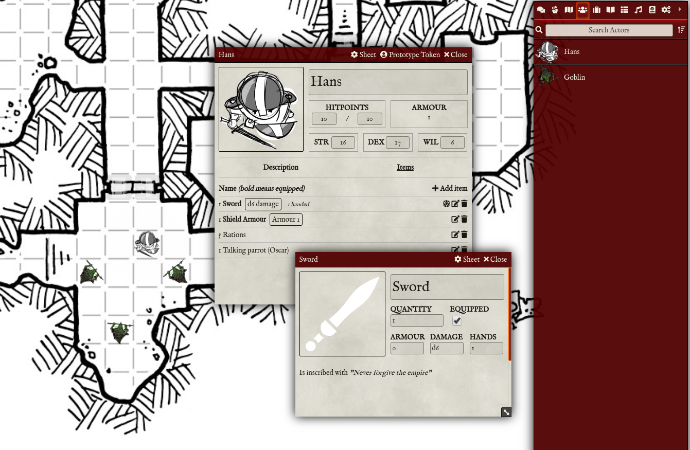

# Into the Odd for Foundry VTT

This project enables you to play [this game](https://www.drivethrurpg.com/fr/product/399483/into-the-odd-remastered) on [this virtual tabletop software](https://foundryvtt.com/).

Map in the background made by [Dyson Logos](https://dysonlogos.blog/).

## Installation

Follow [this guide](https://foundryvtt.com/article/installation/#system) to install game systems in Foundry VTT.

## Development philosophy of this project

The goal of the project is to make Into the Odd playable in Foundry VTT. You will still need the book to play.
The version is now the Remastered Version.

## Features

### Character Sheet
- Strength, Dexterity and Willpower
- Hitpoints
- Armor : calculated automatically based on Item with the subType Armour
- Experience level
- Deprived and Critical statuses
- In the menu : Short rest and Full rest implemented (if not deprived)
- Biography : Text editor
- Inventory : List of all the items, with for each item a menu (Roll damage, Equip, Unequip, Edit, Delete)

### Encounter Sheet

### Item Sheet
- SubType : Armour, Weapon or Equipment
- Arcana, Bulky and Equipped information

## Licences
<ul>
<li>All HTML, CSS and Javascript in this project is licensed under <a href="https://choosealicense.com/licenses/gpl-3.0/">GNU General Public License v3.0</a></li>

<li>Foundry VTT support is covered by the following license: <a href="https://foundryvtt.com/article/license/">Limited License Agreement for module development 17/02/2021</a>.</li>
</ul>